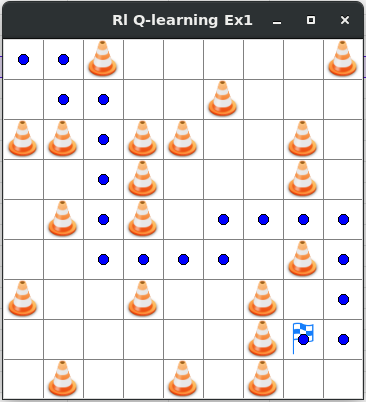
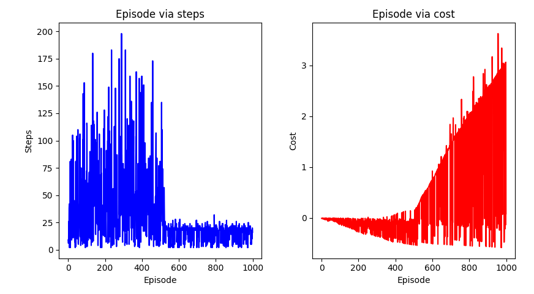

# Reinforcement Learning in Python for Beginner
Implement Reinforcement Learning (RL) Algorithms for global path planning in tasks of mobile robot navigation. 
Language: Python 

### Example 1
Environment-1 with robot, obstacles and goal
 
The results chart
